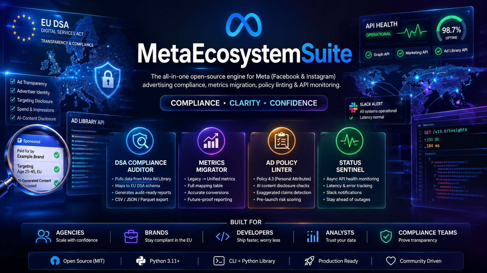

# MetaEcosystemSuite

<p align="center">
  
</p>

<p align="center">

[](https://www.python.org/)
[](https://opensource.org/licenses/MIT)
[](https://developers.facebook.com/)
[](https://ec.europa.eu/)

</p>

---

## Overview

**MetaEcosystemSuite** is an open-source enterprise framework designed to simplify development, regulatory compliance, analytics migration, advertisement validation, and infrastructure monitoring across the Meta (Facebook & Instagram) ecosystem.

The suite provides a unified toolkit for developers, agencies, researchers, and organizations building applications around the Meta Graph API and Marketing API.

---

# Core Modules

### DSA Compliance Auditor

Transforms Meta Ad Library API responses into datasets compatible with the European Union Digital Services Act transparency requirements.

---

### Metrics Migration Engine

Automatically converts deprecated Meta metrics into the latest reporting schema while preserving historical analytical consistency.

Examples:

- Reach → Views
- Impressions → Viewers

---

### Ad Policy Linter

Performs static analysis before ad submission.

Checks include:

- AI disclosure compliance
- Personal Attributes Policy (Meta Policy 4.3)
- Landing page consistency
- Advertising risk analysis

---

### Status Sentinel

Continuously monitors Graph API endpoints.

Features:

- Latency monitoring
- API availability
- Health checks
- Async monitoring
- Automation-friendly output

---

# Quick Start

Clone the repository

```bash
git clone https://github.com/Ciprian-LocalPulse/meta-ecosystem-suite.git

cd meta-ecosystem-suite
```

Install

```bash
pip install -e .
```

Run Policy Linter

```bash
meta-suite lint \
    --text "Do you suffer from anxiety? Buy now!" \
    --is-ai True
```

Normalize Metrics

```bash
meta-suite normalize \
    --impressions 15000 \
    --reach 4500
```

---

# Repository Structure

```
meta_ecosystem_suite/
│
├── compliance/
├── metrics/
├── policy_linter/
├── status_sentinel/
├── cli.py
└── utils/
```

---

# Technology Stack

- Python 3.11+
- Pydantic v2
- HTTPX
- Typer
- Rich
- Polars
- APScheduler
- Jinja2

---

# License

This project is released under the **MIT License**.

See the **LICENSE** file for complete license information.

---

## Copyright

Copyright © 2026 Ciprian Stefan.

Released under the MIT License.

The MetaEcosystemSuite name, project branding, logos, documentation, and original artwork remain attributed to Ciprian Stefan.
